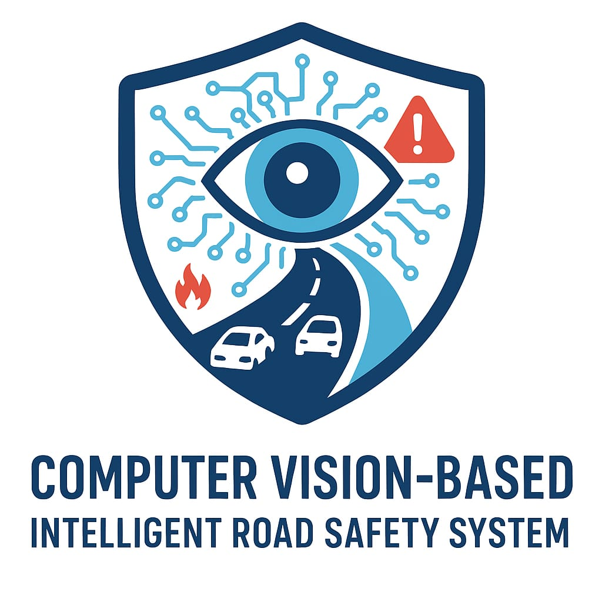

<p align="center">
  
  <h1 align="center">Computer Vision-Based Intelligent Road Safety System</h1>
</p>

---

## Table of Contents
- [Introduction](#introduction) <br>
- [Abstract](#abstract) <br>
- [Requirements](#requirements) <br>
- [Installation and Usage](#installation-and-usage) <br>
- [How It Works](#how-it-works) <br>
- [Preview](#preview) <br>
- [Improvements](#improvements)

---

## Introduction
<p align="left">
With the rapid increase in vehicle density and high-speed travel on highways like the Outer Ring Road (ORR), road accidents and safety violations have become a growing concern. Traditional monitoring systems often rely heavily on human supervision, which can delay response times and overlook critical incidents.  
To address these challenges, this project leverages the power of <b>computer vision</b> and <b>artificial intelligence</b> to create an automated system capable of real-time surveillance and safety analysis using existing CCTV infrastructure. By detecting accidents, rash driving, unsafe passenger behavior, and other anomalies, the system aims to bridge the gap between surveillance and active intervention, ultimately saving lives and enhancing road safety management.
</p>

---

## Abstract
<p align="left">
The <b>Intelligent Road Safety System</b> is designed to enhance safety measures on the <b>Outer Ring Road (ORR)</b> using advanced computer vision and artificial intelligence. By leveraging existing <b>CCTV camera networks</b>, the system performs <b>real-time monitoring</b> and provides <b>automated responses</b> to critical safety incidents.  
<br><br>
Key features include:
<ul>
  <li><b>Accident Detection:</b> Continuous CCTV surveillance detects accidents and automatically alerts emergency services for rapid response.</li>
  <li><b>Rash Driving Detection:</b> Identifies abrupt lane changes and erratic vehicle behavior to trigger warnings or generate safety alerts.</li>
  <li><b>Passenger Safety Monitoring:</b> Detects unsafe passenger behavior such as hands outside windows or clothing caught in doors, displaying safety alerts in real time.</li>
</ul>
By integrating <b>AI-powered visual monitoring</b> with <b>automated alert systems</b>, the solution strengthens traffic surveillance, boosts emergency responsiveness, and reduces road-related risks on major expressways like ORR.
</p>

---

## Requirements
|||
|--|--|
| Python | 3.10 or later |
| OpenCV | 4.9.0 |
| NumPy | 1.26.4 |
| Ultralytics YOLO | 8.0+ |
| EasyOCR | 1.7.1 |
| MediaPipe | 0.10.9 |
| Streamlit | 1.32.0 |

---

## Installation and Usage

### Step 1: Clone the repository
```bash
https://github.com/AAC-Open-Source-Pool/Computer-Vision-Based-Intelligent-Road-Safety-System.git
```

### Step 2: Create a virtual environment (recommended)
```bash
python -m venv venv
source venv/bin/activate      # For Linux/Mac
venv\Scripts\activate         # For Windows
```

### Step 3: Install dependencies
```bash
pip install -r requirements.txt
```

### Step 4: Run the project
For terminal:
```bash
python main.py
```

For Streamlit interface:
```bash
streamlit run gui.py
```

---

## How It Works
1. **Live CCTV Feed Integration** – Connects to existing camera networks for continuous road monitoring.  
2. **Object and Vehicle Detection** – YOLOv8 identifies vehicles, people, and potential hazards in real time.  
3. **Rash Driving Recognition** – Detects overspeeding, abrupt lane switching, and erratic movement patterns.  
4. **Accident Detection** – Flags collisions and triggers automated alerts to relevant authorities.  
5. **Passenger Behavior Analysis** – Uses MediaPipe-based pose and gesture detection to identify unsafe passenger actions.  
6. **Automated Hospital Alert and Response System** – Automatically identifies nearby hospitals and sends real-time alerts through the hospital management website to ensure rapid medical assistance.

---

## Preview

 


---

## Improvements
1. Integrate real-time speed estimation using frame differencing or radar data.  
2. Deploy an IoT-based alerting system for nearby emergency units.  
3. Add audio-based alert detection for horn/siren recognition.  
4. Create a centralized dashboard for live analytics and heatmap visualization.  
5. Develop a mobile app for instant alerts and traffic insights.
